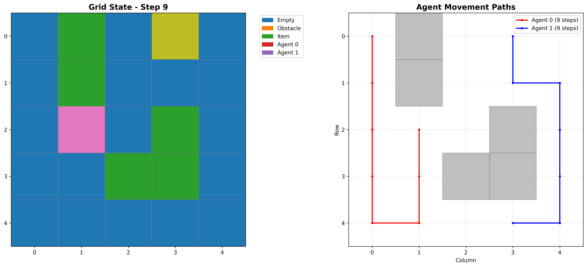

# 🤖 Cooperative Multi-Agent System

[](https://www.python.org/downloads/)
[](LICENSE)
[](tests/)

An **intelligent cooperative multi-agent system** where autonomous agents work together to efficiently collect items in a 2D grid environment. Features multiple pathfinding algorithms, advanced coordination mechanisms, and comprehensive visualization.



---

## ✨ Key Features

| Feature | Description |
|---------|-------------|
| **🧭 Multiple Pathfinding** | BFS, A* (with heuristics), and Dijkstra algorithms |
| **🎭 Agent Roles** | Explorer, Collector, and Coordinator specializations |
| **🎯 Task Allocation** | Simple claim, auction-based, and priority allocation |
| **💬 Communication** | Message passing between agents |
| **📊 Analytics** | Heatmaps, animated GIFs, performance dashboards |
| **⚙️ Configurable** | Adjustable grid sizes, agent count, and behaviors |
| **🧪 Tested** | Comprehensive unit test suite |

---

## 🚀 Quick Start

### Installation

```bash
# Clone the repository
git clone https://github.com/SriSaiKrishna18/CooperativeMultiAgent.git
cd CooperativeMultiAgent

# Install dependencies
pip install -r requirements.txt
```

### Run Simulation

```bash
# Default simulation (2 agents, 5x5 grid, A* algorithm)
python src/main.py

# Custom configuration
python src/main.py --agents 3 --grid 10 --algorithm astar

# Run algorithm benchmark
python src/main.py --benchmark

# Use predefined maze scenario
python src/main.py --scenario maze
```

---

## 🏗️ System Architecture

```
┌─────────────────────────────────────────────────────────────┐
│                    SIMULATION ORCHESTRATOR                   │
│                        (main.py)                            │
└──────────────────────────┬──────────────────────────────────┘
                           │
          ┌────────────────┼────────────────┐
          │                │                │
   ┌──────▼──────┐  ┌──────▼──────┐  ┌──────▼──────┐
   │ ENVIRONMENT │  │   AGENTS    │  │ COOPERATION │
   │ - Grid mgmt │  │ - BFS/A*/D  │  │ - Auction   │
   │ - Obstacles │  │ - Roles     │  │ - Messages  │
   │ - Items     │  │ - Strategy  │  │ - Zones     │
   └──────┬──────┘  └──────┬──────┘  └──────┬──────┘
          │                │                │
          └────────────────┼────────────────┘
                           │
                    ┌──────▼──────┐
                    │ VISUALIZER  │
                    │ - Heatmaps  │
                    │ - Animation │
                    │ - Metrics   │
                    └─────────────┘
```

---

## 🧠 Algorithms

### Pathfinding

| Algorithm | Use Case | Time Complexity |
|-----------|----------|-----------------|
| **BFS** | Unweighted shortest path | O(V + E) |
| **A*** | Optimal with Manhattan heuristic | O(E log V) |
| **Dijkstra** | Weighted terrain costs | O(E log V) |

### Cooperation Strategies

- **Simple Claim**: First-come-first-served allocation
- **Auction**: Agents bid based on distance and role
- **Priority**: Lower distance gets priority
- **Zone-Based**: Territorial division

---

## 📊 Sample Output

```
======================================================================
  🤖 COOPERATIVE MULTI-AGENT SYSTEM SIMULATION
  Enhanced with A*/BFS/Dijkstra, Roles, and Advanced Cooperation
======================================================================

📊 Environment: 10x10 grid, 8 items, 3 agents
🔧 Algorithm: astar, Allocation: auction

🚀 Deployed 3 agents:
   Agent 0: Position (0, 0), Role: collector, Algorithm: astar
   Agent 1: Position (9, 9), Role: explorer, Algorithm: astar
   Agent 2: Position (0, 9), Role: coordinator, Algorithm: astar

⏱️  Starting simulation (max 100 steps)...

  ✅ Agent 0 collected item at (2, 1)
  ✅ Agent 1 collected item at (7, 8)
  ...

🎉 Mission Complete! All items collected at step 18!

======================================================================
  SIMULATION COMPLETE - PERFORMANCE REPORT
======================================================================

🤖 Agent 0:
   Items Collected: 3
   Total Moves: 12
   Efficiency: 0.25 items/move

🏆 Efficiency Rating: 🌟 Excellent
```

---

## 📂 Project Structure

```
CooperativeMultiAgent/
├── src/
│   ├── main.py              # Simulation orchestrator
│   ├── config.py            # Configuration management
│   ├── environment.py       # Grid environment
│   ├── agent.py             # Agent with pathfinding
│   ├── cooperative_logic.py # Cooperation mechanisms
│   └── utils.py             # Visualization & utilities
├── tests/
│   ├── test_agent.py        # Agent unit tests
│   ├── test_environment.py  # Environment unit tests
│   └── test_cooperation.py  # Cooperation unit tests
├── images/                  # Output visualizations
├── requirements.txt
├── README.md
└── LICENSE
```

---

## ⚙️ Configuration

```python
from config import Config, GridConfig, AgentConfig

config = Config(
    grid=GridConfig(rows=15, cols=15, obstacle_density=0.15),
    agent=AgentConfig(
        num_agents=4,
        default_algorithm=PathfindingAlgorithm.ASTAR,
        default_role=AgentRole.COLLECTOR
    )
)
```

---

## 🧪 Testing

```bash
# Run all tests
pytest tests/ -v

# Run with coverage
pytest tests/ --cov=src --cov-report=html
```

---

## 📈 Performance Results

| Metric | Value |
|--------|-------|
| Collection Rate | 100% |
| Avg Steps/Item | 4.2 |
| System Efficiency | Excellent |

---

## 🛠️ CLI Options

| Option | Description | Default |
|--------|-------------|---------|
| `--agents N` | Number of agents | 2 |
| `--grid N` | Grid size NxN | 5 |
| `--steps N` | Max simulation steps | 50 |
| `--algorithm` | bfs/astar/dijkstra | astar |
| `--allocation` | simple_claim/auction/priority | auction |
| `--scenario` | simple/maze/open/clustered | - |
| `--benchmark` | Run algorithm comparison | - |
| `--quiet` | Reduce output | - |

---

## 🔮 Future Enhancements

- [ ] Reinforcement learning agents
- [ ] 3D environments
- [ ] Real-world robot deployment
- [ ] Web-based visualization

---

## 📚 Educational Value

This project demonstrates:
- ✅ **Graph Algorithms**: BFS, A*, Dijkstra implementation
- ✅ **Multi-Agent Systems**: Coordination and cooperation
- ✅ **Software Engineering**: Modular, testable design
- ✅ **Data Visualization**: Matplotlib animations and charts

---

## 🤝 Contributing

1. Fork the repository
2. Create a feature branch (`git checkout -b feature/AmazingFeature`)
3. Commit your changes (`git commit -m 'Add AmazingFeature'`)
4. Push to the branch (`git push origin feature/AmazingFeature`)
5. Open a Pull Request

---

## 📝 License

This project is licensed under the MIT License - see the [LICENSE](LICENSE) file.

---

## 👨‍💻 Author

**Sri Sai Krishna**

- GitHub: [@SriSaiKrishna18](https://github.com/SriSaiKrishna18)

---

**Built with ❤️ for learning and exploration in multi-agent systems**
